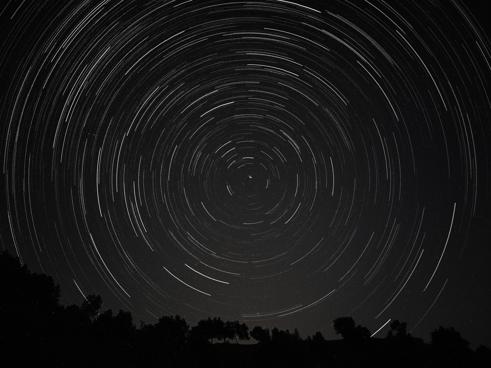
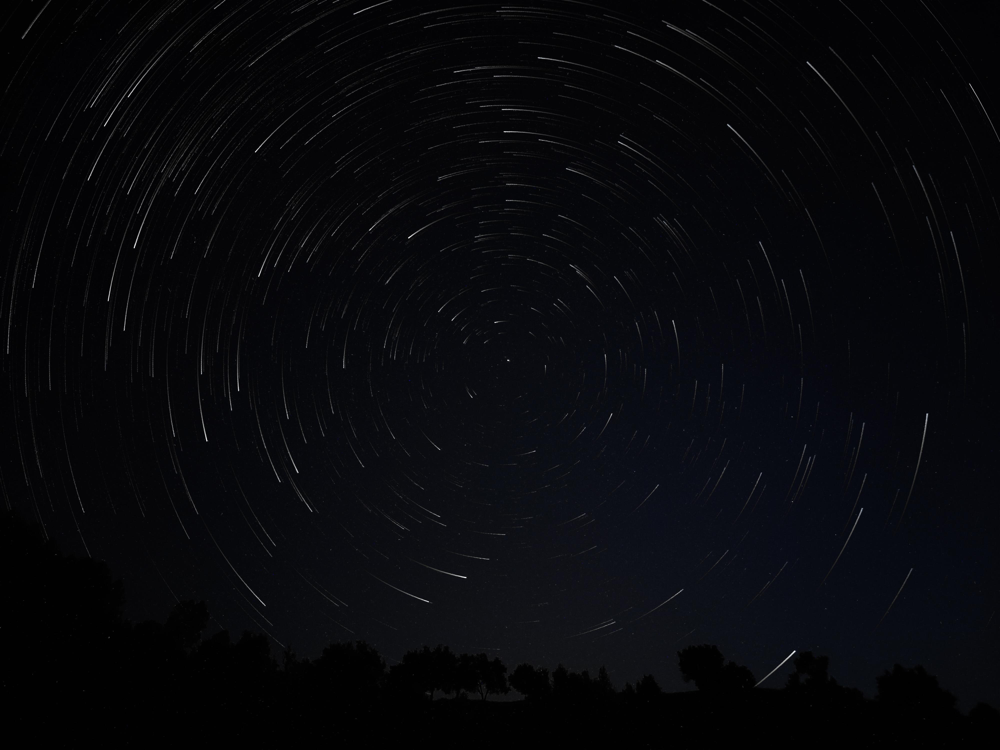
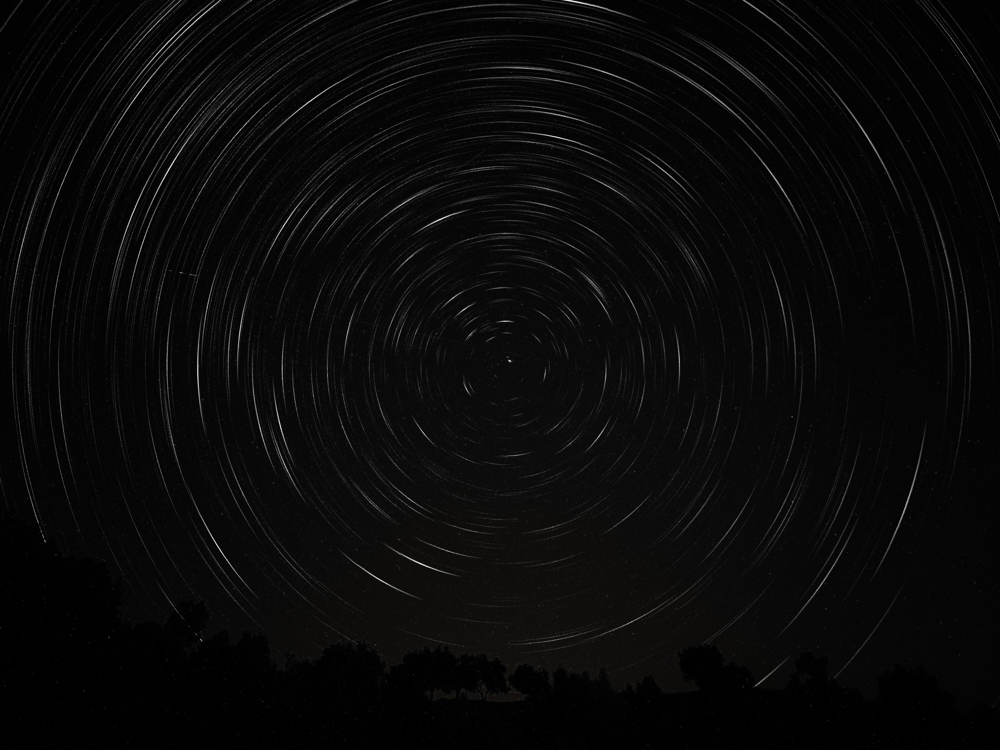

# PyStarTrails


This repository allows you to create star trails images and timelapse videos using Python. The project uses [numpy](https://github.com/numpy/numpy) for image stacking and [imageio](https://github.com/imageio/imageio) for timelapse generation. Currently, you can run the provided Python scripts manually. In the future, I plan to add a GUI (Graphical User Interface) to make the process even easier.

## Live demo

https://github.com/user-attachments/assets/a23a6de4-e19d-4c2e-8bec-afd0c538a003

## Features

### Stack images

You can stack multiple images to create a star trails effect. You have three scripts that control the shape of the trails:

- [stack_all_images.py](./stack_all_images.py): This is the basic script that stacks all images together. It does not apply any special effects to the trails.
- [stack_all_images_comet_style.py](./stack_all_images_comet_style.py): This script creates a comet-style effect, where the trails have a fading effect, making them look like comets.
- [stack_all_images_fade_in_fade_out.py](./stack_all_images_fade_in_fade_out.py): This script creates trails that fade in and fade out.

Here are images generated using each of the three scripts:

| Basic stacking | Comet style | Fade in/out |
|:--------------:|:-----------:|:-----------:|
|  |  |  |

### Create timelapse videos

Before creating a timelapse video, use the [generate_timelapse_frames.py](./generate_timelapse_frames.py) script to generate frames from your images. After generating the frames, you can create a timelapse video using the [create_timelapse_video.py](./create_timelapse_video.py) script.

Here is the timelapse that I generated from my star trails images in 60 FPS:


## Usage

First, clone the repository and navigate to the project directory:

```bash
git clone https://github.com/ImadSaddik/PyStarTrails.git
cd PyStarTrails
```

Install the [uv](https://github.com/astral-sh/uv) package manager if you don't have it already:

```bash
# On macOS and Linux.
curl -LsSf https://astral.sh/uv/install.sh | sh

# On Windows.
powershell -ExecutionPolicy ByPass -c "irm https://astral.sh/uv/install.ps1 | iex"
```

Now, update the project's environment:

```bash
uv sync
```

Place your `jpg` or `png` images in the `stacking_input` folder. To stack images, run one of the stacking scripts. For example, to use the basic stacking script:

```bash
uv run python stack_all_images.py
```

To create a timelapse video, first generate the frames:

```bash
uv run python generate_timelapse_frames.py
```

Then, create the timelapse video:

```bash
uv run python create_timelapse_video.py
```

## Future work

I have pushed the first version of this project earlier than expected to share it with everyone. I have more ideas in mind to improve this project, I will work on them when I find some free time:

- [ ] Add a GUI (Graphical User Interface) to make it easier for users to select images and choose options.
- [ ] Separate the GUI from the CLI (Command-Line Interface) scripts.
- [ ] Add support for gap filling in star trails.
- [ ] Add the possibility to choose the star trails effect when generating the timelapse frames.

## License

This project is licensed under the [MIT License](./LICENSE).

## Contributions

I welcome contributions! If you have any ideas or improvements, feel free to open an issue or submit a pull request.

This project uses `ruff` for linting and formatting and `pre-commit` hooks to make sure that the code stays clean and consistent. Before you start, please set up your development environment.

Install the [ruff](https://github.com/astral-sh/ruff) linter globally:

```bash
# On macOS and Linux.
curl -LsSf https://astral.sh/ruff/install.sh | sh

# On Windows.
powershell -c "irm https://astral.sh/ruff/install.ps1 | iex"
```

Sync the development dependencies:

```bash
uv sync --group dev
```

Install the pre-commit hooks:

```bash
uv run pre-commit install
```

Now, the linter and formatter will run automatically before each commit.

## Need help?

You can reach me through:

- **LinkedIn** – [Connect with me](https://www.linkedin.com/in/imadsaddik/).
- **Email** – [simad3647@gmail.com](mailto:simad3647@gmail.com).
